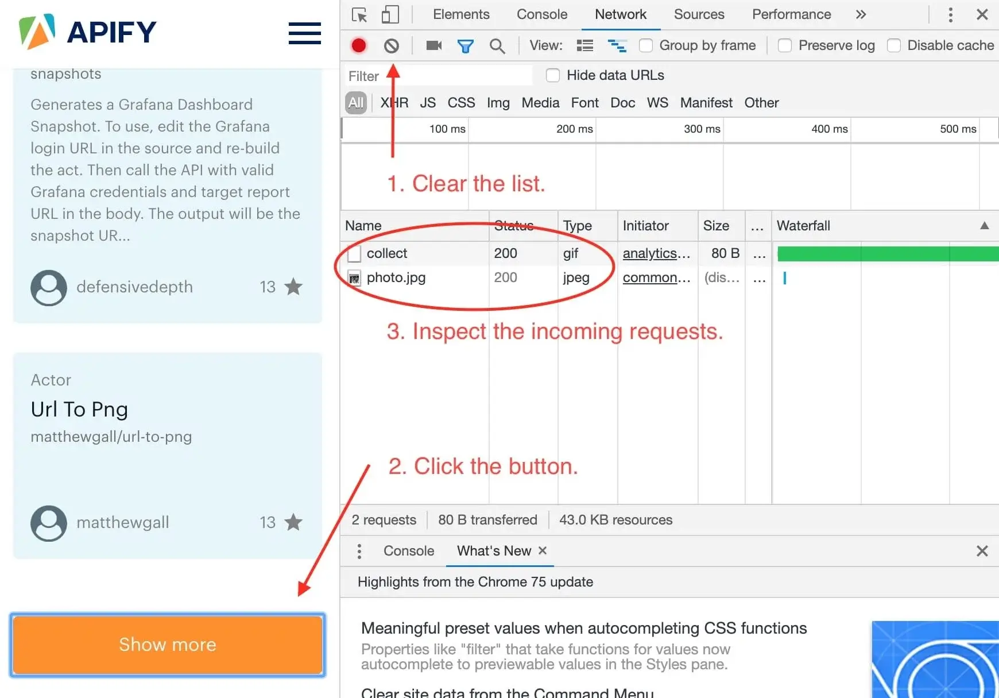
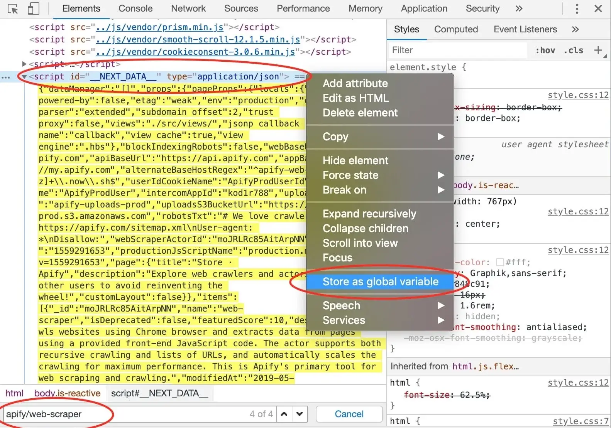
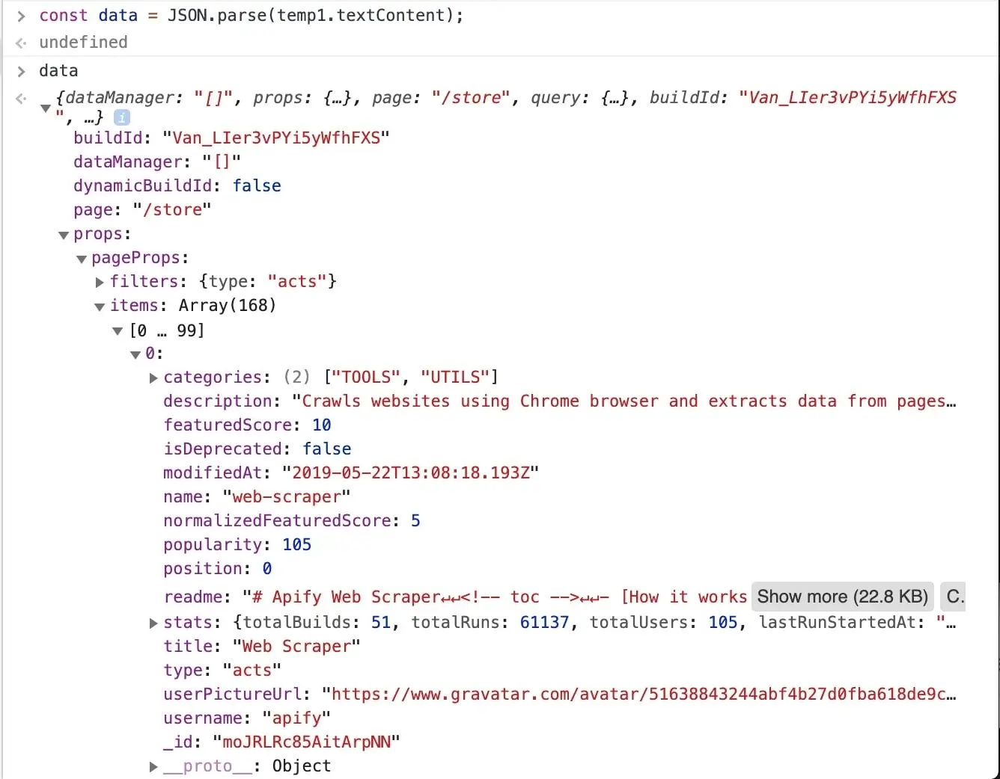

# Scraping with Cheerio Scraper

This scraping tutorial will go into the nitty gritty details of extracting data from **<https://apify.com/store>**
using **Cheerio Scraper** ([apify/cheerio-scraper](https://apify.com/apify/cheerio-scraper)). If you arrived here from the [Getting started with Apify scrapers](https://docs.apify.com/tutorials/apify-scrapers/getting-started),
tutorial, great! You are ready to continue where we left off. If you haven't seen the Getting started yet,
check it out, it will help you learn about Apify and scraping in general and set you up for this tutorial,
because this one builds on topics and code examples discussed there.

## [](#getting-to-know-our-tools) Getting to know our tools

In the [Getting started with Apify scrapers](https://docs.apify.com/tutorials/apify-scrapers/getting-started) tutorial, we've confirmed that the scraper works as expected,
so now it's time to add more data to the results.

To do that, we'll be using the [Cheerio](https://github.com/cheeriojs/cheerio) library. This may not sound familiar,
so let's try again. Does [jQuery](https://jquery.com/) ring a bell? If it does you're in luck,
because Cheerio is just jQuery that doesn't need an actual browser to run. Everything else is the same.
All the functions you already know are there and even the familiar `$` is used. If you still have no idea what either
of those are, don't worry. We'll walk you through using them step by step.

> [Check out the Cheerio docs](https://github.com/cheeriojs/cheerio) to learn more about it.

Now that's out of the way, let's open one of the actor detail pages in the Store, for example the
**Web Scraper** ([apify/web-scraper](https://apify.com/apify/web-scraper)) page, and use our DevTools-Fu to scrape some data.

> If you're wondering why we're using Web Scraper as an example instead of Cheerio Scraper,
it's only because we didn't want to triple the number of screenshots we needed to make. Lazy developers!

## [](#building-our-page-function) Building our Page function

Before we start, let's do a quick recap of the data we chose to scrape:

   1. **URL** - The URL that goes directly to the actor's detail page.
   2. **Unique identifier** - Such as **apify/web-scraper**.
   3. **Title** - The title visible in the actor's detail page.
   4. **Description** - The actor's description.
   5. **Last modification date** - When the actor was last modified.
   6. **Number of runs** - How many times the actor was run.


We've already scraped number 1 and 2 in the [Getting started with Apify scrapers](https://docs.apify.com/tutorials/apify-scrapers/getting-started)
tutorial, so let's get to the next one on the list: title.

### [](#title) Title


By using the element selector tool, we find out that the title is there under an `<h1>` tag, as titles should be.
Maybe surprisingly, we find that there are actually two `<h1>` tags on the detail page. This should get us thinking.
Is there any parent element that includes our `<h1>` tag, but not the other ones? Yes, there is! There is a `<header>`
element that we can use to select only the heading we're interested in.

> Remember that you can press CTRL+F (CMD+F) in the Elements tab of DevTools to open the search bar where you can quickly search for elements using
> their selectors. And always make sure to use the DevTools to verify your scraping process and assumptions. It's faster than changing the crawler
> code all the time.

To get the title we just need to find it using a `header h1` selector, which selects all `<h1>` elements that have a `<header>` ancestor.
And as we already know, there's only one.

```js
// Using Cheerio.
return {
    title: $('header h1').text(),
};
```

### [](#description) Description

Getting the actor's description is a little more involved, but still pretty straightforward. We can't just simply search for a `<p>` tag, because
there's a lot of them in the page. We need to narrow our search down a little. Using the DevTools we find that the actor description is nested within
the `<header>` element too, same as the title. Moreover, the actual description is nested inside a `<span>` tag with a class `actor-description`.


```js
return {
    title: $('header h1').text(),
    description: $('header span.actor-description').text(),
};
```

### [](#modified-date) Modified date

The DevTools tell us that the `modifiedDate` can be found in a `<time>` element.


```js
return {
    title: $('header h1').text(),
    description: $('header span.actor-description').text(),
    modifiedDate: new Date(
        Number(
            $('ul.ActorHeader-stats time').attr('datetime'),
        ),
    ),
};
```

It might look a little too complex at first glance, but let us walk you through it. We find all the `<time>` elements. Then, we read its `datetime` attribute, because that's where a unix timestamp is stored as a `string`.

But we would much rather see a readable date in our results, not a unix timestamp, so we need to convert it. Unfortunately the `new Date()`
constructor will not accept a `string`, so we cast the `string` to a `number` using the `Number()` function before actually calling `new Date()`.
Phew!

### [](#run-count) Run count

And so we're finishing up with the `runCount`. There's no specific element like `<time>`, so we need to create
a complex selector and then do a transformation on the result.

```js
return {
    title: $('header h1').text(),
    description: $('header span.actor-description').text(),
    modifiedDate: new Date(
        Number(
            $('ul.ActorHeader-stats time').attr('datetime'),
        ),
    ),
    runCount: Number(
        $('ul.ActorHeader-stats > li:nth-of-type(3)')
            .text()
            .match(/[\d,]+/)[0]
            .replace(/,/g, ''),
    ),
};
```

The `ul.ActorHeader-stats > li:nth-of-type(3)` looks complicated, but it only reads that we're looking for a `<ul class="ActorHeader-stats ...">` element and within that
element we're looking for the third `<li>` element. We grab its text, but we're only interested in the number of runs. So we parse the number out
using a regular expression, but its type is still a `string`, so we finally convert the result to a `number` by wrapping it with a `Number()` call.

> The numbers are formatted with commas as thousands separators (e.g. `'1,234,567'`), so to extract it, we
> first use regular expression `/[\d,]+/` - it will search for consecutive number or comma characters.
> Then we extract the match via `.match(/[\d,]+/)[0]` and finally remove all the commas by calling `.replace(/,/g, '')`.
> We need to use `/,/g` with the global modifier to support large numbers with multiple separators, without it
> we would replace only the very first occurrence.
> 
> This will give us a string (e.g. `'1234567'`) that can be converted via `Number` function.

### [](#wrapping-it-up) Wrapping it up

And there we have it! All the data we needed in a single object. For the sake of completeness, let's add
the properties we parsed from the URL earlier and we're good to go.

```js
const { url } = request;

// ...

const uniqueIdentifier = url
    .split('/')
    .slice(-2)
    .join('/');

return {
    url,
    uniqueIdentifier,
    title: $('header h1').text(),
    description: $('header span.actor-description').text(),
    modifiedDate: new Date(
        Number(
            $('ul.ActorHeader-stats time').attr('datetime'),
        ),
    ),
    runCount: Number(
        $('ul.ActorHeader-stats > li:nth-of-type(3)')
            .text()
            .match(/[\d,]+/)[0]
            .replace(/,/g, ''),
    ),
};
```

All we need to do now is add this to our `pageFunction`:

```js
async function pageFunction(context) {
    // $ is Cheerio
    const { request, log, skipLinks, $ } = context;
    if (request.userData.label === 'START') {
        log.info('Store opened!');
        // Do some stuff later.
    }
    if (request.userData.label === 'DETAIL') {
        const { url } = request;
        log.info(`Scraping ${url}`);
        await skipLinks();

        // Do some scraping.
        const uniqueIdentifier = url
            .split('/')
            .slice(-2)
            .join('/');

        return {
            url,
            uniqueIdentifier,
            title: $('header h1').text(),
            description: $('header span.actor-description').text(),
            modifiedDate: new Date(
                Number(
                    $('ul.ActorHeader-stats time').attr('datetime'),
                ),
            ),
            runCount: Number(
                $('ul.ActorHeader-stats > li:nth-of-type(3)')
                    .text()
                    .match(/[\d,]+/)[0]
                    .replace(/,/g, ''),
            ),
        };
    }
}
```

### [](#test-run) Test run

As always, try hitting that **Save & Run** button  and visit
the **Dataset** preview of clean items. You should see a nice table of all the attributes correctly scraped.
You nailed it!

## [](#pagination) Pagination

Pagination is just a term that represents "going to the next page of results". You may have noticed that we did not
actually scrape all the actors, just the first page of results. That's because to load the rest of the actors,
one needs to click the **Show more** button at the very bottom of the list. This is pagination.

> This is a typical JavaScript pagination, sometimes called infinite scroll. Other pages may use links
that take you to the next page. If you encounter those, just make a Pseudo URL for those links and they
will be automatically enqueued to the request queue. Use a label to let the scraper know what kind of URL
it's processing.

If you paid close attention, you may now see a problem. How do we click a button in the page when we're working
with Cheerio? We don't have a browser to do it and we only have the HTML of the page to work with. So the simple
answer is that we can't click a button. Does that mean that we cannot get the data at all? Usually not,
but it requires some clever DevTools-Fu.

### [](#analyzing-the-page) Analyzing the page

While with Web Scraper and **Puppeteer Scraper** ([apify/puppeteer-scraper](https://apify.com/apify/puppeteer-scraper)), we could get away with simply clicking a button,
with Cheerio Scraper we need to dig a little deeper into the page's architecture. For this, we will use
the Network tab of the Chrome DevTools.

> DevTools is a powerful tool with many features, so if you're not familiar with it, please [see Google's tutorial](https://developers.google.com/web/tools/chrome-devtools/network/), which explains everything much better than we ever could.

We want to know what happens when we click the **Show more** button, so we open the DevTools **Network** tab and clear it.
Then we click the **Show more** button and wait for incoming requests to appear in the list.



Now, this is interesting. It seems that we've only received two images after clicking the button and no additional
data. This means that the data about actors must already be available in the page and the **Show more** button only displays it. This is good news.

### [](#finding-the-actors) Finding the actors

Now that we know the information we seek is already in the page, we just need to find it. The first actor in the store
is Web Scraper, so let's try using the search tool in the **Elements** tab to find some reference to it. The first
few hits do not provide any interesting information, but in the end, we find our goldmine. There is a `<script>` tag,
with the ID `__NEXT_DATA__` that seems to hold a lot of information about Web Scraper. In DevTools,
you can right click an element and click **Store as global variable** to make this element available in the **Console**.



A `temp1` variable is now added to your console. We're mostly interested in its contents and we can get that using
the `temp1.textContent` property. You can see that it's a rather large JSON string. How do we know?
The `type` attribute of the `<script>` element says `application/json`. But working with a string would be very
cumbersome, so we need to parse it.

```js
const data = JSON.parse(temp1.textContent);
```

After entering the above command into the console, we can inspect the `data` variable and see that all the information
we need is there, in the `data.props.pageProps.items` array. Great!



> It's obvious that all the information we set to scrape is available in this one data object,
so you might already be wondering, can I just make one request to the store to get this JSON
and then parse it out and be done with it in a single request? Yes you can! And that's the power
of clever page analysis.

### [](#using-the-data-to-enqueue-all-actor-details) Using the data to enqueue all actor details

We don't really need to go to all the actor details now, but for the sake of practice, let's imagine we only found
actor names such as `cheerio-scraper` and their owners, such as `apify` in the data. We will use this information
to construct URLs that will take us to the actor detail pages and enqueue those URLs into the request queue.

```js
// We're not in DevTools anymore,
// so we use Cheerio to get the data.
const dataJson = $('#__NEXT_DATA__').html();
// We requested HTML, but the data are actually JSON.
const data = JSON.parse(dataJson);

for (const item of data.props.pageProps.items) {
    const { name, username } = item;
    const actorDetailUrl = `https://apify.com/${username}/${name}`;
    await context.enqueueRequest({
        url: actorDetailUrl,
        userData: {
            // Don't forget the label.
            label: 'DETAIL',
        }
    });
}
```

We iterate through the items we found, build actor detail URLs from the available properties and then enqueue
those URLs into the request queue. We need to specify the label too, otherwise our page function wouldn't know
how to route those requests.

>If you're wondering how we know the structure of the URL, see the [Getting started
with Apify Scrapers](intro-scraper-tutorial) tutorial again.

### [](#plugging-it-into-the-page-function) Plugging it into the Page function

We've got the general algorithm ready, so all that's left is to integrate it into our earlier `pageFunction`.
Remember the `// Do some stuff later` comment? Let's replace it.

```js
async function pageFunction(context) {
    const { request, log, skipLinks, $ } = context;
    if (request.userData.label === 'START') {
        log.info('Store opened!');

        const dataJson = $('#__NEXT_DATA__').html();
        // We requested HTML, but the data are actually JSON.
        const data = JSON.parse(dataJson);

        for (const item of data.props.pageProps.items) {
            const { name, username } = item;
            const actorDetailUrl = `https://apify.com/${username}/${name}`;
            await context.enqueueRequest({
                url: actorDetailUrl,
                userData: {
                    label: 'DETAIL',
                },
            });
        }
    }
    if (request.userData.label === 'DETAIL') {
        const { url } = request;
        log.info(`Scraping ${url}`);
        await skipLinks();

        // Do some scraping.
        const uniqueIdentifier = url
            .split('/')
            .slice(-2)
            .join('/');

        return {
            url,
            uniqueIdentifier,
            title: $('header h1').text(),
            description: $('header span.actor-description').text(),
            modifiedDate: new Date(
                Number(
                    $('ul.ActorHeader-stats time').attr('datetime'),
                ),
            ),
            runCount: Number(
                $('ul.ActorHeader-stats > li:nth-of-type(3)')
                    .text()
                    .match(/[\d,]+/)[0]
                    .replace(/,/g, ''),
            ),
        };
    }
}
```

That's it! You can now remove the **Max pages per run** limit, **Save & Run** your task and watch the scraper
scrape all of the actors' data. After it succeeds, open the **Dataset** tab again click on **Preview**.
You should have a table of all the actor's details in front of you. If you do, great job! You've successfully
scraped Apify Store. And if not, no worries, just go through the code examples again, it's probably just some typo.

> There's an important caveat. The way we implemented pagination here is in no way a generic system that you can easily
use with other websites. Cheerio is fast (and that means it's cheap), but it's not easy. Sometimes there's just no way
to get all results with Cheerio only and other times it takes hours of research. Keep this in mind when choosing
the right scraper for your job. But don't get discouraged. Often times, the only thing you will ever need is to
define a correct Pseudo URL. So do your research first before giving up on Cheerio Scraper.

## [](#downloading-our-scraped-data) Downloading the scraped data

You already know the **Dataset** tab of the run console since this is where we've always previewed our data. Notice the row of data formats such as JSON, CSV, and Excel. Below it are options for viewing and downloading the data. Go ahead and try it.

> If you prefer working with an API, you can find the example endpoint under the API tab: **Get dataset items**.

### [](#clean-items) Clean items

You can view and download your data without modifications, or you can choose to only get **clean** items. Data that aren't cleaned include a record
for each `pageFunction` invocation, even if you did not return any results. The record also includes hidden fields
such as `#debug`, where you can find a variety of information that can help you with debugging your scrapers.

Clean items, on the other hand, include only the data you returned from the `pageFunction`. If you're only interested in the data you scraped, this format is what you will be using most of the time.

To control this, open the **Advanced options** view on the **Dataset** tab.

## [](#bonus-making-your-code-neater) Bonus: Making your code neater

You may have noticed that the `pageFunction` gets quite bulky. To make better sense of your code and have an easier
time maintaining or extending your task, feel free to define other functions inside the `pageFunction`
that encapsulate all the different logic. You can, for example, define a function for each of the different pages:

```js
async function pageFunction(context) {
    switch (context.request.userData.label) {
        case 'START': return handleStart(context);
        case 'DETAIL': return handleDetail(context);
    }

    async function handleStart({ log, waitFor, $ }) {
        log.info('Store opened!');

        const dataJson = $('#__NEXT_DATA__').html();
        // We requested HTML, but the data are actually JSON.
        const data = JSON.parse(dataJson);

        for (const item of data.props.pageProps.items) {
            const { name, username } = item;
            const actorDetailUrl = `https://apify.com/${username}/${name}`;
            await context.enqueueRequest({
                url: actorDetailUrl,
                userData: {
                    label: 'DETAIL',
                },
            });
        }
    }

    async function handleDetail({ request, log, skipLinks, $ }) {
        const { url } = request;
        log.info(`Scraping ${url}`);
        await skipLinks();

        // Do some scraping.
        const uniqueIdentifier = url
            .split('/')
            .slice(-2)
            .join('/');

        return {
            url,
            uniqueIdentifier,
            title: $('header h1').text(),
            description: $('header span.actor-description').text(),
            modifiedDate: new Date(
                Number(
                    $('ul.ActorHeader-stats time').attr('datetime'),
                ),
            ),
            runCount: Number(
                $('ul.ActorHeader-stats > li:nth-of-type(3)')
                    .text()
                    .match(/[\d,]+/)[0]
                    .replace(/,/g, ''),
            ),
        };
    }
}
```

> If you're confused by the functions being declared below their executions, it's called hoisting and it's a feature
of JavaScript. It helps you put what matters on top, if you so desire.

## [](#final-word) Final word

Thank you for reading this whole tutorial! Really! It's important to us that our users have the best information available to them so that they can use Apify easily and effectively. We're glad that you made it all the way here and congratulations on creating your first scraping task. We hope that you liked the tutorial and if there's anything you'd like to ask, [join us on Discord](https://discord.gg/jyEM2PRvMU)!

## [](#whats-next) What's next?

* Check out the [Apify SDK](https://sdk.apify.com/) and its [Getting started](https://sdk.apify.com/docs/guides/getting-started) tutorial if you'd like to try building your own actors. It's a bit more complex and involved than writing a simple `pageFunction`, but it allows you to fine-tune all the details of your scraper to your liking.
* [Take a deep dive into actors](https://docs.apify.com/actors), from how they work to [publishing](https://docs.apify.com/actors/publishing) them in Apify Store, and even [making money](https://blog.apify.com/make-regular-passive-income-developing-web-automation-actors-b0392278d085/) on actors.
* Found out you're not into the coding part but would still to use Apify actors? Check out our [ready-made solutions](https://apify.com/store) or [order a custom actor](https://apify.com/custom-solutions) from an Apify-certified developer.
