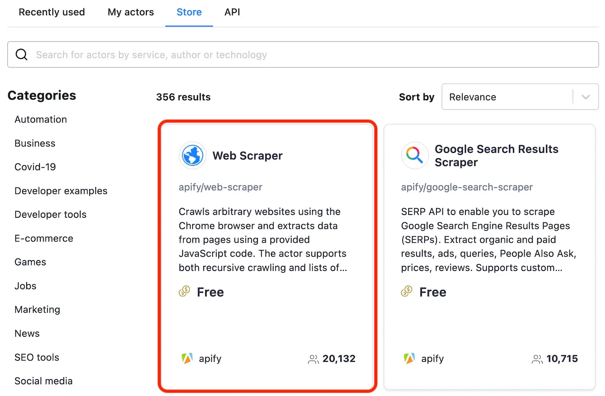
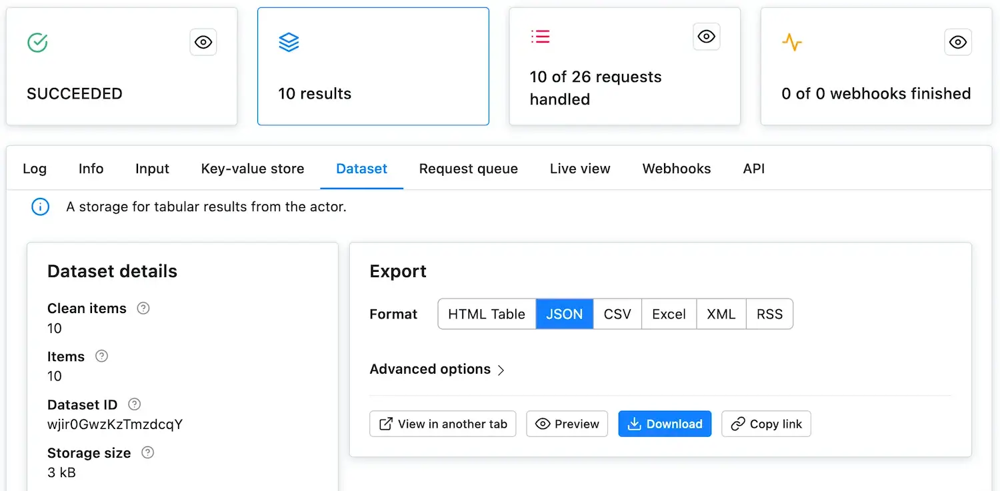
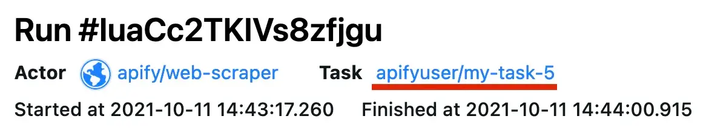
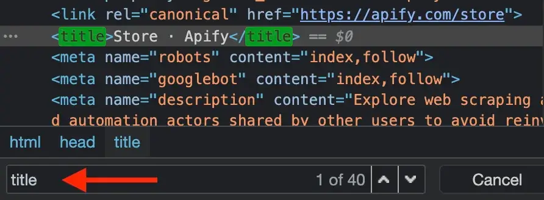

# Getting started with Apify scrapers

Welcome to the getting started tutorial! It will walk you through creating your first scraping task step by step. You will learn how to set up all the different configuration options, code a **Page function** (`pageFunction`), and finally download the scraped data either as an Excel sheet or in another format, such as JSON or CSV. But first, let's give you a brief introduction to web scraping with Apify.

## [](#what-is-an-apify-scraper) What is an Apify scraper

It doesn't matter whether you arrived here from **Web Scraper** ([apify/web-scraper](https://apify.com/apify/web-scraper)), **Puppeteer Scraper** ([apify/puppeteer-scraper](https://apify.com/apify/puppeteer-scraper)) or **Cheerio Scraper** ([apify/cheerio-scraper](https://apify.com/apify/cheerio-scraper)).  All of them are **actors** and for now, let's just think of an **actor** as an application that you can use with your own configuration. **apify/web-scraper** is therefore an application called **web-scraper**, built by **apify**, that you can configure to scrape any webpage. We call these configurations **tasks**.

> If you need help choosing the right scraper, see this [great article](https://help.apify.com/en/articles/3024655-choosing-the-right-solution). And if you just want to learn more about actors in general, you can read our [actors page](https://apify.com/actors) or [browse the documentation](https://docs.apify.com/actors).

You can create 10 different **tasks** for 10 different websites, with very different options, but there will always be just one **actor**, the `apify/*-scraper` you chose. This is the essence of tasks. They are nothing but **saved configurations** of the actor that you can run easily and repeatedly.

## [](#trying-it-out) Trying it out

Depending on how you arrived at this tutorial, you may already have your first task created for the scraper of your choice. If not, the easiest way is to go to [Apify Store](https://console.apify.com/actors#/store/) and select the actor you want to base your task on. Then, click the **Create a new task** button in the top-right corner.

> This tutorial covers the use of **Web**, **Cheerio**, and **Puppeteer** scrapers, but a lot of the information here can be used with all actors. For this tutorial, we will select **Web Scraper**.



### [](#running-a-task) Running a task

This takes you to the **Input and options** tab of the task configuration. Before we delve into the details, let's just see how the example works. There are already some pre-configured input values. It says that the task should visit **<https://apify.com>** and all its subpages, such as **<https://apify.com/contact>** and scrape some data using the provided `pageFunction`, specifically the `<title>` of the page and its URL.

Scroll down to the **Performance and limits** section and set the **Max pages per run** option to **10**. This tells your task to finish after 10 pages have been visited. We don't need to crawl the whole domain just to see that the actor works.

> This also helps with keeping your [compute unit](https://docs.apify.com/actors/running/compute-units) (CU) consumption low. Just to get an idea, our free plan includes 10 CUs and this run will consume about 0.04 CU, so you can run it 250 times a month for free. If you accidentally go over the limit, no worries, we won't charge you for it. You just won't be able to run more tasks that month.

Now click **Save & Run**! *(in the bottom-left part of your screen)*

### [](#the-run-detail) The run detail

After clicking **Save & Run**, the window will change to the run detail. Here, you will see the run's log. If it seems that nothing is happening, don't worry, it takes a few seconds for the run to fully boot up. In under a minute, you should have the 10 pages scraped. You will know that the run successfully completed when the `RUNNING` card in top-left corner changes to `SUCCEEDED`.

> Feel free to browse through the various new tabs: **Log**, **Info**, **Input** and other, but for the sake of brevity, we will not explain all their features in this tutorial.

Now that the run has `SUCCEEDED`, click on the glowing **Results** card to see the scrape's results. This takes you to the **Dataset** tab, where you can display or download the results in various formats. For now, just click the **Preview** button. Voila, the scraped data!



Good job! We've run our first task and got some results. Let's learn how to change the default configuration to scrape something more interesting than just the page's `<title>`.

## [](#creating-your-own-task) Creating your own task

Before we jump into the scraping itself, let's just have a quick look at the user interface that's available to us. Click on the task's name in the top-left corner to visit the task's configuration.



### [](#input) Input and options

The **Input** tab is where we started and it's the place where you create your scraping configuration. The actor's creator prepares the **Input** form so that you can easily tell the actor what to do. Feel free to check the tooltips of the various options to get a better idea of what they do. To display the tooltip, just click the question mark next to each input field's name.

> We will not go through all the available input options in this tutorial. See the actor's README for detailed information.

Below the input fields are the Build, Timeout and Memory options. Let's keep them at default settings for now. Just remember that if you see a yellow `TIMED-OUT` status after running your task, you might want to come back here and increase the timeout.

> Timeouts are there to prevent tasks from running forever. Always set a reasonable timeout to prevent a rogue task from eating up all your compute units.

### [](#settings) Settings

In the settings tab, you can set options that are common to all tasks and not directly related to the actor's purpose. Unless you've already changed the task's name, it's set to **my-task**, so why not try changing it to **my-first-scraper** and clicking **Save**.

### [](#runs) Runs

You can find all the task runs and their detail pages here. Every time you start a task, it will appear here in the list. All of your task's runs and their outcomes will be stored here for the data retention period, [which you can find under your plan](https://apify.com/pricing).

### [](#webhooks) Webhooks

Webhooks are a feature that help keep you aware of what's happening with your tasks. You can set them up to inform you when a task starts, finishes, fails and so on, or you can even use them to run more tasks, depending on the outcome of the original one. [See webhooks documentation](https://docs.apify.com/webhooks).

### [](#readme) Information

Since tasks are just configurations for actors, this tab shows you all the information about the underlying actor, the Apify scraper of your choice. You can see the available versions and their READMEs - it's always a good idea to read an actor's README first before creating a task for it.

### [](#api) API

The API tab gives you a quick overview of all the available API calls in case you would like to use your task programmatically. It also includes links to detailed API documentation. You can even try it out immediately using the **Test endpoint** button.

> Never share a URL containing the authentication token (`?token=...` parameter in the URLs), as this will compromise your account's security.

## [](#scraping-theory) Scraping theory

Since this is a tutorial, we'll be scraping our own website. [Apify Store](https://apify.com/store) is great candidate for some scraping practice. It's a page that uses modern web technologies and displays a lot of different items in various categories, just like an online store, a typical scraping target, would.

### [](#the-goal) The goal

We want to create a scraper that scrapes all the actors in the store and collects the following attributes for each actor:

   1. **URL** - The URL that goes directly to the actor's detail page.
   2. **Unique identifier** - Such as **apify/web-scraper**.
   3. **Title** - The title visible in the actor's detail page.
   4. **Description** - The actor's description.
   5. **Last modification date** - When the actor was last modified.
   6. **Number of runs** - How many times the actor was run.

Some of this information may be scraped directly from the listing pages, but for the rest, we will need to visit the detail pages of all the actors.

### [](#the-start-url) The start URL

Let's start with something simple. In the **Input** tab of the task we have, we'll change the **Start URL** from **<https://apify.com>**. This will tell the scraper to start by opening a different URL. You can add more **Start URL**s or even [use a file with a list of thousands of them](https://docs.apify.com/tutorials/crawl-urls-from-a-google-sheet), but in this case, we'll be good with just one.

How do we choose the new **Start URL**? The goal is to scrape all actors in the store, which is available at [https://apify.com/store](https://apify.com/store), so we choose this URL as our **Start URL**.

```text
https://apify.com/store
```

We also need to somehow distinguish the **Start URL** from all the other URLs that the scraper will add later. To do this, click the **Details** button in the **Start URL** form and see the **User data** input. Here you can add any information you'll need during the scrape in a JSON format. For now, just add a label to the **Start URL**.

```json
{
  "label": "START"
}
```

### [](#filtering-with-a-link-selector) Filtering with a Link selector

The **Link selector**, together with **Pseudo URL**s, are your URL matching arsenal. The Link selector is a CSS selector and its purpose is to select the HTML elements where the scraper should look for URLs. And by looking for URLs, we mean finding the elements' `href` attributes. For example, to enqueue URLs from `<div class="my-class" href=...>` tags, we would enter `'div.my-class'`.

What's the connection to **Pseudo URL**s? Well, first, all the URLs found in the elements that match the Link selector are collected. Then, **Pseudo URL**s are used to filter through those URLs and enqueue only the ones that match the **Pseudo URL** structure. Simple.

To scrape all the actors in Apify Store, we should use the Link selector to tell the scraper where to find the URLs we need. For now, let us just tell you that the Link selector you're looking for is:

```css
div.item > a
```

Save it as your **Link selector**. If you're wondering how we figured this out, just follow along with the tutorial. By the time we finish, you'll know why we used this selector, too.

### [](#crawling-the-website-with-pseudo-url) Crawling the website with pseudo URLs

What is a **Pseudo URL**? Let us explain. Before we can start scraping the actor details, we need to find all the links to the details. If the links follow a set structure, we can use a certain pattern to describe this structure. And that's what a **Pseudo URL** is. A pattern that describes a URL structure. By setting a **Pseudo URL**, all links that follow the given structure will automatically be added to the crawling queue.

Let's see an example. To find the pattern, open some of the actor details in the store. You'll find that the URLs are always structured the same:

```text
https://apify.com/{OWNER}/{NAME}
```

In the structures, only the `OWNER` and `NAME` change. We can leverage this in a **Pseudo URL**.

#### Making a pseudo URL

If you'd like to learn more about **Pseudo URL**s, [visit a quick tutorial in our docs](https://docs.apify.com/tutorials/apify-scrapers/getting-started#crawling-the-website-with-pseudo-url), but for now, let's keep it simple. **Pseudo URL**s are really just URLs with some variable parts in them. Those variable parts are represented by [regular expressions](https://regexone.com/) enclosed in brackets `[]`.

So, working with our actor details example, we could produce a **Pseudo URL** like this:

```text
https://apify.com/[.+]/[.+]
```

This **Pseudo URL** will match all actor detail pages, such as:

```text
https://apify.com/apify/web-scraper
```

But it will not match pages we're not interested in, such as:

```text
https://apify.com/contact
```

In addition, together with the filter we set up using the **Link selector**, the scraper will now avoid URLs such as:

```text
https://apify.com/industries/manufacturing
```

This is because even though it matches our **Pseudo URL**'s format, the HTML element that contains it does not match the `div.item > a` element we specified in the **Link selector**.

Let's use the above **Pseudo URL** in our task. We should also add a label as we did with our **Start URL**. This label will be added to all pages that were enqueued into the request queue using the given **Pseudo URL**.

```json
{
  "label": "DETAIL"
}
```

### [](#test-run) Test run

Now that we've added some configuration, it's time to test it. Just run the task, keeping the **Max pages per run** set to `10` and the `pageFunction` as it is. You should see in the log that the scraper first visits the **Start URL** and then several of the actor details matching the **Pseudo URL**.

## [](#the-page-function) The page function

The `pageFunction` is a JavaScript function that gets executed for each page the scraper visits. To figure out how to create it, you must first inspect the page's structure to get an idea of its inner workings. The best tools for that are a browser's inbuilt developer tools - DevTools.

### [](#using-devtools) Using DevTools

Open [Apify Store](https://apify.com/store) in the Chrome browser (or use any other browser, just note that the DevTools may differ slightly) and open the DevTools, either by right-clicking on the page and selecting **Inspect** or by pressing **F12**.

The DevTools window will pop up and display a lot of, perhaps unfamiliar, information. Don't worry about that too much - just open the Elements tab (the one with the page's HTML). The Elements tab allows you to browse the page's structure and search within it using the search tool. You can open the search tool by pressing **CTRL+F** or **CMD+F**. Try typing **title** into the search bar.

You'll see that the Element tab jumps to the first `<title>` element of the current page and that the title is **Store · Apify**. It's always good practice to do your research using the DevTools before writing the `pageFunction` and running your task.



> For the sake of brevity, we won't go into the details of using the DevTools in this tutorial. If you're just starting out with DevTools, this [Google tutorial](https://developers.google.com/web/tools/chrome-devtools/) is a good place to begin.

### [](#understanding-context) Understanding `context`

The `pageFunction` has access to global variables such as `window` and `document`, which are provided by the browser, as well as to `context`, which is the `pageFunction`'s single argument. `context` carries a lot of useful information and helpful functions, which are described in the actor's README.

### [](#new-page-function-boilerplate) New page function boilerplate

We know that we'll visit two kinds of pages, the list page (**Start URL**) and the detail pages (enqueued using the **Pseudo URL**). We want to enqueue links on the list page and scrape data on the detail page.

Since we're not covering jQuery in this tutorial for the sake of brevity, replace the default boilerplate with the code below.

```js
async function pageFunction(context) {
    const { request, log, skipLinks } = context;
    if (request.userData.label === 'START') {
        log.info('Store opened!');
        // Do some stuff later.
    }
    if (request.userData.label === 'DETAIL') {
        log.info(`Scraping ${request.url}`);
        await skipLinks();
        // Do some scraping.
        return {
            // Scraped data.
        }
    }
}
```

This may seem like a lot of new information, but it's all connected to our earlier configuration.

### [](#context-request) `context.request`

The `request` is an instance of the [`Request`](https://sdk.apify.com/docs/api/request) class and holds information about the currently processed page, such as its `url`. Each `request` also has the `request.userData` property of type `Object`. While configuring the **Start URL** and the **Pseudo URL**, we gave them a `label`. We're now using them in the `pageFunction` to distinguish between the store page and the detail pages.

### [](#context-skip-links) `context.skipLinks()`

When a **Pseudo URL** is set, the scraper attempts to enqueue matching links on each page it visits. `skipLinks()` is used to tell the scraper that we don't want this to happen on the current page.

### [](#context-log) `context.log`

`log` is used for printing messages to the console. You may be tempted to use `console.log()`, but this will not work unless you turn on the **Browser log** option. `log.info()` should be used for general messages, but you can also use `log.debug()` for messages that will only be shown when you turn on the **Debug log** option. [See the docs for more info](https://sdk.apify.com/docs/api/log).

### [](#the-page-functions-return-value) The page function's return value

The `pageFunction` may only return nothing, `null`, `Object` or `Object[]`. If an `Object` is returned, it will be saved as a single result. Returning an `Array` of `Objects` will save each item in the array as a result.

The scraping results are saved in a [dataset](https://docs.apify.com/storage/dataset) (one of the tabs in the run console, as you may remember). It behaves like a table. Each item is a row in the table and its properties are its columns. Returning the following `Object`:

```js
{
    url: 'https://apify.com',
    title: 'Web Scraping, Data Extraction and Automation - Apify'
}
```

will produce the following table:

| title | url |
| ----- | --- |
| Web Scraping, Data Extraction and Automation - Apify | <https://apify.com> |

## [](#scraper-lifecycle) Scraper lifecycle

Now that we're familiar with all the pieces in the puzzle, we'll quickly take a look at the scraper lifecycle,
or in other words, what the scraper actually does when it scrapes. It's quite straightforward.

The scraper:

 1. Visits the first **Start URL** and waits for the page to load.
 2. Executes the `pageFunction`.
 3. Finds all the elements matching the **Link selector** and extracts their `href` attributes (URLs).
 4. Uses the **pseudo URLs** to filter the extracted URLs and throws away those that don't match.
 5. Enqueues the matching URLs to the end of the crawling queue.
 6. Closes the page and selects a new URL to visit, either from the **Start URL**s if there are any left, or from the beginning of the crawling queue.

> When you're not using the request queue, the scraper just repeats steps 1 and 2. You would not use the request queue when you already know all the URLs you want to visit. For example, when you have a pre-existing list of a thousand URLs that you uploaded as a text file. Or when scraping just a single URL.

## [](#scraping-practice) Scraping practice

We've covered all the concepts that we need to understand to successfully scrape the data in our goal,
so let's get to it and start with something really simple. We will only output data that are already available
to us in the page's URL. Remember from [our goal](#the-goal) that we also want to include the **URL** and a **Unique
identifier** in our results. To get those, we just need the `request.url` because it is the URL and
includes the Unique identifier.

```js
const { url } = request;
const uniqueIdentifier = url.split('/').slice(-2).join('/');
```

### [](#test-run-2) Test run 2

We'll add our first data to the `pageFunction` and carry out a test run to see that everything works as expected.

```js
async function pageFunction(context) {
    const { request, log, skipLinks } = context;
    if (request.userData.label === 'START') {
        log.info('Store opened!');
        // Do some stuff later.
    }
    if (request.userData.label === 'DETAIL') {
        const { url } = request;
        log.info(`Scraping ${url}`);
        await skipLinks();

        // Do some scraping.
        const uniqueIdentifier = url
            .split('/')
            .slice(-2)
            .join('/');

        return {
            url,
            uniqueIdentifier,
        };
    }
}
```

Now **Save & Run** the task and once it finishes, check the dataset by clicking on the **Results** card. Click **Preview** and you should see the URLs and unique identifiers scraped. Great job!

## [](#choosing-sides) Choosing sides

Up until now, everything has been the same for all the Apify scrapers. Whether you're using Web Scraper,
Puppeteer Scraper or Cheerio Scraper, what you've learned now will always be the same.
This is great if you ever need to switch scrapers, because there's no need to learn everything from scratch.

There are differences in the code we use in the `pageFunction` though. Often subtle, sometimes large.
In the next part of the tutorial, we'll focus on the individual scrapers' specific implementation details.
So, it's time to choose sides. But don't worry, at Apify, no side is the dark side.

- [Web Scraper tutorial](https://docs.apify.com/tutorials/apify-scrapers/web-scraper)
- [Cheerio Scraper tutorial](https://docs.apify.com/tutorials/apify-scrapers/cheerio-scraper)
- [Puppeteer Scraper tutorial](https://docs.apify.com/tutorials/apify-scrapers/puppeteer-scraper)
