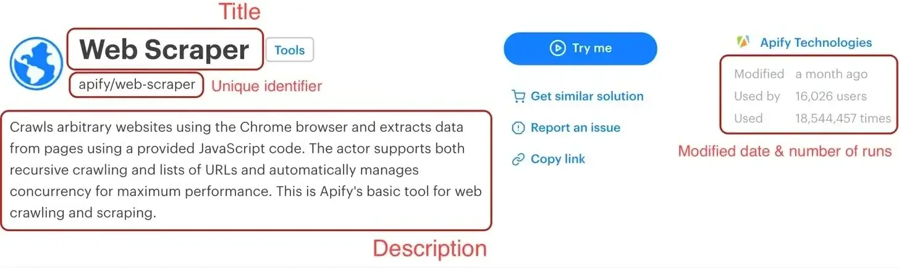
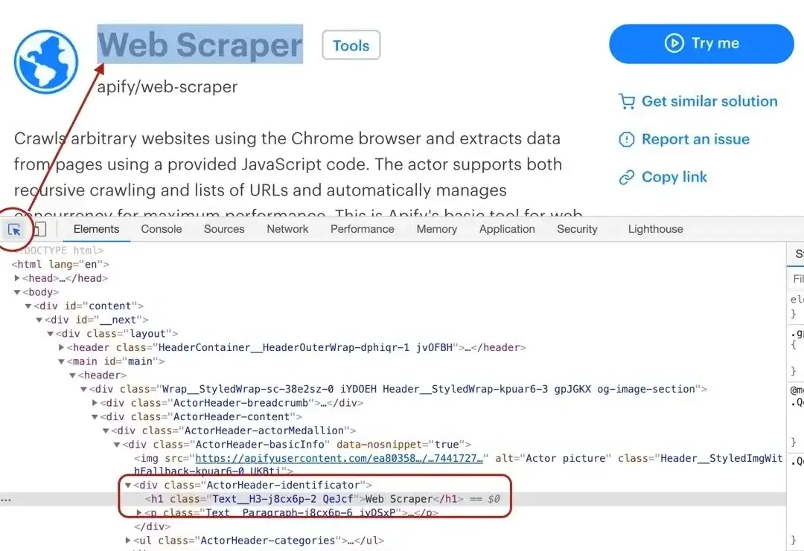
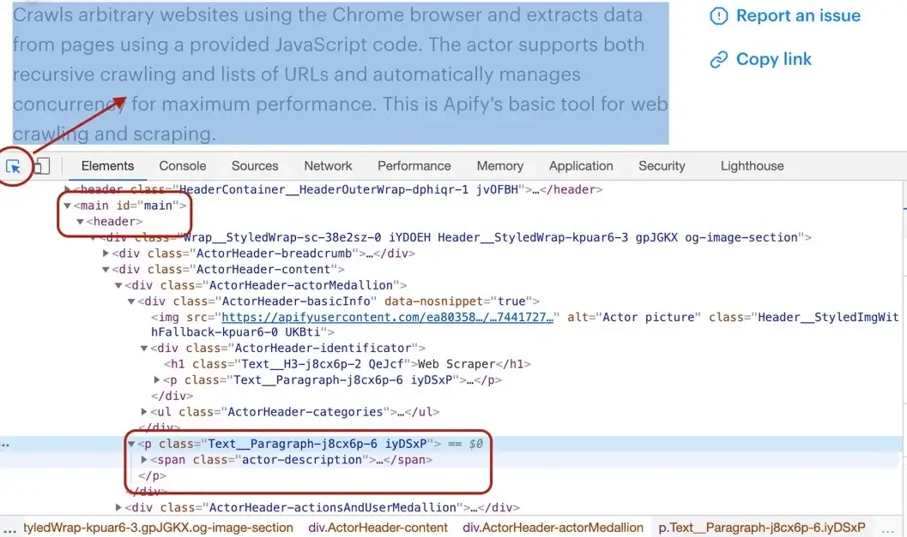
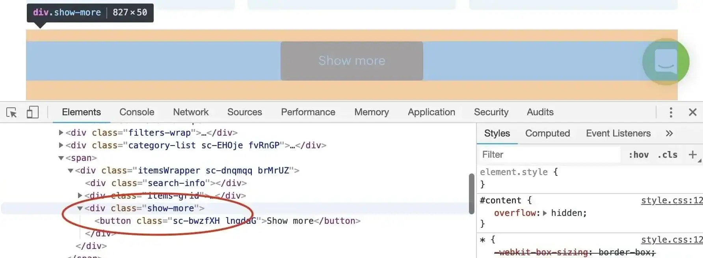

# Scraping with Web Scraper

This scraping tutorial will go into the nitty gritty details of extracting data from **<https://apify.com/store>**
using **Web Scraper** ([apify/web-scraper](https://apify.com/apify/web-scraper)). If you arrived here from the [Getting started with Apify scrapers](https://docs.apify.com/tutorials/apify-scrapers/getting-started),
tutorial, great! You are ready to continue where we left off. If you haven't seen the Getting started yet,
check it out, it will help you learn about Apify and scraping in general and set you up for this tutorial,
because this one builds on topics and code examples discussed there.

## [](#getting-to-know-our-tools) Getting to know our tools

In the [Getting started with Apify scrapers](https://apify.com/docs/scraping/tutorial/introduction) tutorial,
we've confirmed that the scraper works as expected, so now it's time to add more data to the results.

To do that, we'll be using the [jQuery library](https://jquery.com/), because it provides some nice tools
and a lot of people familiar with JavaScript already know how to use it.

> [Check out the jQuery docs](https://api.jquery.com/) if you're not familiar with it. And if you just don't want to use it, that's okay. Everything can be done using pure JavaScript, too.

To add jQuery, all we need to do is turn on **Inject jQuery** under the  **Input and options** tab.
This will add a `context.jQuery` function that you can use.

Now that's out of the way, let's open one of the actor detail pages in the Store, for example
the [Web Scraper](https://apify.com/apify/web-scraper) page and use our DevTools-Fu to scrape some data.

## [](#building-our-page-function) Building our Page function

Before we start, let's do a quick recap of the data we chose to scrape:

   1. **URL** - The URL that goes directly to the actor's detail page.
   2. **Unique identifier** - Such as **apify/web-scraper**.
   3. **Title** - The title visible in the actor's detail page.
   4. **Description** - The actor's description.
   5. **Last modification date** - When the actor was last modified.
   6. **Number of runs** - How many times the actor was run.



We've already scraped number 1 and 2 in the [Getting started with Apify scrapers](https://docs.apify.com/tutorials/apify-scrapers/getting-started)
tutorial, so let's get to the next one on the list: title.

### [](#title) Title



By using the element selector tool, we find out that the title is there under an `<h1>` tag, as titles should be.
Maybe surprisingly, we find that there are actually two `<h1>` tags on the detail page. This should get us thinking.
Is there any parent element that includes our `<h1>` tag, but not the other ones? Yes, there is! There is a `<header>`
element that we can use to select only the heading we're interested in.

> Remember that you can press CTRL+F (CMD+F) in the Elements tab of DevTools to open the search bar where you can quickly search for elements using
> their selectors. And always make sure to use the DevTools to verify your scraping process and assumptions. It's faster than changing the crawler
> code all the time.

To get the title we just need to find it using a `header h1` selector, which selects all `<h1>` elements that have a `<header>` ancestor.
And as we already know, there's only one.

```js
// Using jQuery.
return {
    title: $('header h1').text(),
};
```

### [](#description) Description

Getting the actor's description is a little more involved, but still pretty straightforward. We can't just simply search for a `<p>` tag, because
there's a lot of them in the page. We need to narrow our search down a little. Using the DevTools we find that the actor description is nested within
the `<header>` element too, same as the title. Moreover, the actual description is nested inside a `<span>` tag with a class `actor-description`.



```js
return {
    title: $('header h1').text(),
    description: $('header span.actor-description').text(),
};
```

### [](#modified-date) Modified date

The DevTools tell us that the `modifiedDate` can be found in a `<time>` element.


```js
return {
    title: $('header h1').text(),
    description: $('header span.actor-description').text(),
    modifiedDate: new Date(
        Number(
            $('ul.ActorHeader-stats time').attr('datetime'),
        ),
    ),
};
```

It might look a little too complex at first glance, but let us walk you through it. We find all the `<time>` elements. Then, we read its `datetime` attribute, because that's where a unix timestamp is stored as a `string`.

But we would much rather see a readable date in our results, not a unix timestamp, so we need to convert it. Unfortunately the `new Date()`
constructor will not accept a `string`, so we cast the `string` to a `number` using the `Number()` function before actually calling `new Date()`.
Phew!

### [](#run-count) Run count

And so we're finishing up with the `runCount`. There's no specific element like `<time>`, so we need to create
a complex selector and then do a transformation on the result.

```js
return {
    title: $('header h1').text(),
    description: $('header span.actor-description').text(),
    modifiedDate: new Date(
        Number(
            $('ul.ActorHeader-stats time').attr('datetime'),
        ),
    ),
    runCount: Number(
        $('ul.ActorHeader-stats > li:nth-of-type(3)')
            .text()
            .match(/[\d,]+/)[0]
            .replace(/,/g, ''),
    ),
};
```

The `ul.ActorHeader-stats > li:nth-of-type(3)` looks complicated, but it only reads that we're looking for a `<ul class="ActorHeader-stats ...">` element and within that
element we're looking for the third `<li>` element. We grab its text, but we're only interested in the number of runs. So we parse the number out
using a regular expression, but its type is still a `string`, so we finally convert the result to a `number` by wrapping it with a `Number()` call.

> The numbers are formatted with commas as thousands separators (e.g. `'1,234,567'`), so to extract it, we
> first use regular expression `/[\d,]+/` - it will search for consecutive number or comma characters.
> Then we extract the match via `.match(/[\d,]+/)[0]` and finally remove all the commas by calling `.replace(/,/g, '')`.
> We need to use `/,/g` with the global modifier to support large numbers with multiple separators, without it
> we would replace only the very first occurrence.
> 
> This will give us a string (e.g. `'1234567'`) that can be converted via `Number` function.

### [](#wrapping-it-up) Wrapping it up

And there we have it! All the data we needed in a single object. For the sake of completeness, let's add
the properties we parsed from the URL earlier and we're good to go.

```js
const { url } = request;

// ...

const uniqueIdentifier = url.split('/').slice(-2).join('/');

return {
    url,
    uniqueIdentifier,
    title: $('header h1').text(),
    description: $('header span.actor-description').text(),
    modifiedDate: new Date(
        Number(
            $('ul.ActorHeader-stats time').attr('datetime'),
        ),
    ),
    runCount: Number(
        $('ul.ActorHeader-stats > li:nth-of-type(3)')
            .text()
            .match(/[\d,]+/)[0]
            .replace(/,/g, ''),
    ),
};
```

All we need to do now is add this to our `pageFunction`:

```js
async function pageFunction(context) {
    // use jQuery as $
    const { request, log, skipLinks, jQuery: $ } = context;

    if (request.userData.label === 'START') {
        log.info('Store opened!');
        // Do some stuff later.
    }
    if (request.userData.label === 'DETAIL') {
        const { url } = request;
        log.info(`Scraping ${url}`);
        await skipLinks();

        // Do some scraping.
        const uniqueIdentifier = url
            .split('/')
            .slice(-2)
            .join('/');

        return {
            url,
            uniqueIdentifier,
            title: $('header h1').text(),
            description: $('header span.actor-description').text(),
            modifiedDate: new Date(
                Number(
                    $('ul.ActorHeader-stats time').attr('datetime'),
                ),
            ),
            runCount: Number(
                $('ul.ActorHeader-stats > li:nth-of-type(3)')
                    .text()
                    .match(/[\d,]+/)[0]
                    .replace(/,/g, ''),
            ),
        };
    }
}
```

### [](#test-run) Test run

As always, try hitting that **Save & Run** button  and visit
the **Dataset** preview of clean items. You should see a nice table of all the attributes correctly scraped.
You nailed it!

## [](#pagination) Pagination

Pagination is just a term that represents "going to the next page of results". You may have noticed that we did not
actually scrape all the actors, just the first page of results. That's because to load the rest of the actors,
one needs to click the **Show more** button at the very bottom of the list. This is pagination.

> This is a typical form of JavaScript pagination, sometimes called infinite scroll. Other pages may just use links
that take you to the next page. If you encounter those, just make a **Pseudo URL** for those links and they will
be automatically enqueued to the request queue. Use a label to let the scraper know what kind of URL it's processing.

### [](#waiting-for-dynamic-content) Waiting for dynamic content

Before we talk about paginating, we need to have a quick look at dynamic content. Since Apify Store is a JavaScript
application (as many, if not most, modern websites are), the button might not exist in the page when the scraper
runs the `pageFunction`.

How is this possible? Because the scraper only waits with executing the `pageFunction` for the page to load its HTML.
If there's additional JavaScript that modifies the DOM afterwards, the `pageFunction` may execute before this
JavaScript had the time to run.

At first, you may think that the scraper is broken, but it just cannot wait for all the JavaScript in the page
to finish executing. For a lot of pages, there's always some JavaScript executing or some network requests being made.
It would never stop waiting. It is therefore up to you, the programmer, to wait for the elements you need.
Fortunately, we have an easy solution.

#### The `context.waitFor()` function

`waitFor()` is a function that's available on the `context` object passed to the `pageFunction` and helps you with,
well, waiting for stuff. It accepts either a number of milliseconds to wait, a selector to await in the page,
or a function to execute. It will stop waiting once the time elapses, the selector appears or the provided function
returns `true`.

```js
// Waits for 2 seconds.
await waitFor(2000);
// Waits until an element with id "my-id" appears
// in the page.
await waitFor('#my-id');
// Waits until a "myObject" variable appears
// on the window object.
await waitFor(() => !!window.myObject);
```

The selector may never be found and the function might never return `true`, so the `waitFor()` function also has
a timeout. The default is `20` seconds. You can override it by providing an options object as the second parameter,
with a `timeoutMillis` property.

```js
await waitFor('.bad-class', { timeoutMillis: 5000 });
```

With those tools, you should be able to handle any dynamic content the website throws at you.

### [](#how-to-paginate) How to paginate

With the theory out of the way, this should be pretty easy. The algorithm is a loop:

1. Wait for the **Show more** button.
2. Click it.
3. Is there another **Show more** button?
    - Yes? Repeat the above. (loop)
    - No? We're done. We have all the actors.

#### Waiting for the button

Before we can wait for the button, we need to know its unique selector. A quick look in the DevTools tells us
that the button's class is some weird randomly generated string, but fortunately, there's an enclosing `<div>`
with a class of `show-more`. Great! Our unique selector:

```text
div.show-more > button
```

> Don't forget to confirm our assumption in the DevTools finder tool (CTRL/CMD + F).



Now that we know what to wait for, we just plug it into the `waitFor()` function.

```js
await waitFor('div.show-more > button');
```

#### Clicking the button

We have a unique selector for the button and we know that it's already rendered in the page. Clicking it is a piece of cake. We'll use jQuery again, but feel free to use plain JavaScript, it works the same.

```js
$('div.show-more > button').click()
```

This will show the next page of actors.

#### Repeating the process

We've shown two function calls, but how do we make this work together in the `pageFunction`?

```js
async function pageFunction(context) {

// ...

let timeoutMillis; // undefined
const buttonSelector = 'div.show-more > button';
while (true) {
    log.info('Waiting for the "Show more" button.');
    try {
        // Default timeout first time.
        await waitFor(buttonSelector, { timeoutMillis });
        // 2 sec timeout after the first.
        timeoutMillis = 2000;
    } catch (err) {
        // Ignore the timeout error.
        log.info('Could not find the "Show more button", '
            + 'we\'ve reached the end.');
        break;
    }
    log.info('Clicking the "Show more" button.');
    $(buttonSelector).click();
}

// ...

}
```

We want to run this until the `waitFor()` function throws, so that's why we use a `while(true)` loop. We're also not
interested in the error, because we're expecting it, so we just ignore it and print a log message instead.

You might be wondering what's up with the `timeoutMillis`. Well, for the first page load, we want to wait longer,
so that all the page's JavaScript has had a chance to execute, but for the other iterations, the JavaScript is
already loaded and we're just waiting for the page to re-render so waiting for `2` seconds is enough to confirm
that the button is not there. We don't want to stall the scraper for `20` seconds just to make sure that there's
no button.

### [](#plugging-it-into-the-page-function) Plugging it into the pageFunction

We've got the general algorithm ready, so all that's left is to integrate it into our earlier `pageFunction`.
Remember the `// Do some stuff later` comment? Let's replace it. And don't forget to destructure the `waitFor()`
function on the first line.

```js
async function pageFunction(context) {
    const { request,
        log,
        skipLinks,
        jQuery: $,
        waitFor,
    } = context;

    if (request.userData.label === 'START') {
        log.info('Store opened!');
        let timeoutMillis; // undefined
        const buttonSelector = 'div.show-more > button';
        while (true) {
            log.info('Waiting for the "Show more" button.');
            try {
                // Default timeout first time.
                await waitFor(buttonSelector, { timeoutMillis });
                // 2 sec timeout after the first.
                timeoutMillis = 2000;
            } catch (err) {
                // Ignore the timeout error.
                log.info('Could not find the "Show more button", '
                    + 'we\'ve reached the end.');
                break;
            }
            log.info('Clicking the "Show more" button.');
            $(buttonSelector).click();
        }
    }
    if (request.userData.label === 'DETAIL') {
        const { url } = request;
        log.info(`Scraping ${url}`);
        await skipLinks();

        // Do some scraping.
        const uniqueIdentifier = url
            .split('/')
            .slice(-2)
            .join('/');

        return {
            url,
            uniqueIdentifier,
            title: $('header h1').text(),
            description: $('header span.actor-description').text(),
            modifiedDate: new Date(
                Number(
                    $('ul.ActorHeader-stats time').attr('datetime'),
                ),
            ),
            runCount: Number(
                $('ul.ActorHeader-stats > li:nth-of-type(3)')
                    .text()
                    .match(/[\d,]+/)[0]
                    .replace(/,/g, ''),
            ),
        };
    }
}
```

That's it! You can now remove the **Max pages per run** limit, **Save & Run** your task and watch the scraper paginate
through all the actors and then scrape all of their data. After it succeeds, open the **Dataset** tab again click on **Preview**. You should have a table of all the actor's details in front of you. If you do, great job!
You've successfully scraped Apify Store. And if not, no worries, just go through the code examples again,
it's probably just some typo.


## [](#downloading-our-scraped-data) Downloading the scraped data

You already know the **Dataset** tab of the run console since this is where we've always previewed our data. Notice the row of data formats such as JSON, CSV, and Excel. Below it are options for viewing and downloading the data. Go ahead and try it.

> If you prefer working with an API, you can find the example endpoint under the API tab: **Get dataset items**.

### [](#clean-items) Clean items

You can view and download your data without modifications, or you can choose to only get **clean** items. Data that aren't cleaned include a record
for each `pageFunction` invocation, even if you did not return any results. The record also includes hidden fields
such as `#debug`, where you can find a variety of information that can help you with debugging your scrapers.

Clean items, on the other hand, include only the data you returned from the `pageFunction`. If you're only interested in the data you scraped, this format is what you will be using most of the time.

To control this, open the **Advanced options** view on the **Dataset** tab.

## [](#bonus-making-your-code-neater) Bonus: Making your code neater

You may have noticed that the `pageFunction` gets quite bulky. To make better sense of your code and have an easier
time maintaining or extending your task, feel free to define other functions inside the `pageFunction`
that encapsulate all the different logic. You can, for example, define a function for each of the different pages:

```js
async function pageFunction(context) {
    switch (context.request.userData.label) {
        case 'START': return handleStart(context);
        case 'DETAIL': return handleDetail(context);
    }

    async function handleStart({ log, waitFor }) {
        log.info('Store opened!');
        let timeoutMillis; // undefined
        const buttonSelector = 'div.show-more > button';
        while (true) {
            log.info('Waiting for the "Show more" button.');
            try {
                // Default timeout first time.
                await waitFor(buttonSelector, { timeoutMillis });
                // 2 sec timeout after the first.
                timeoutMillis = 2000;
            } catch (err) {
                // Ignore the timeout error.
                log.info('Could not find the "Show more button", '
                    + 'we\'ve reached the end.');
                break;
            }
            log.info('Clicking the "Show more" button.');
            $(buttonSelector).click();
        }
    }

    async function handleDetail({
        request,
        log,
        skipLinks,
        jQuery: $,
    }) {
        const { url } = request;
        log.info(`Scraping ${url}`);
        await skipLinks();

        // Do some scraping.
        const uniqueIdentifier = url
            .split('/')
            .slice(-2)
            .join('/');

        return {
            url,
            uniqueIdentifier,
            title: $('header h1').text(),
            description: $('header span.actor-description').text(),
            modifiedDate: new Date(
                Number(
                    $('ul.ActorHeader-stats time').attr('datetime'),
                ),
            ),
            runCount: Number(
                $('ul.ActorHeader-stats > li:nth-of-type(3)')
                    .text()
                    .match(/[\d,]+/)[0]
                    .replace(/,/g, ''),
            ),
        };
    }
}
```

> If you're confused by the functions being declared below their executions, it's called hoisting and it's a feature
of JavaScript. It helps you put what matters on top, if you so desire.

## [](#final-word) Final word

Thank you for reading this whole tutorial! Really! It's important to us that our users have the best information available to them so that they can use Apify easily and effectively. We're glad that you made it all the way here and congratulations on creating your first scraping task. We hope that you liked the tutorial and if there's anything you'd like to ask, [join us on Discord](https://discord.gg/jyEM2PRvMU)!

## [](#whats-next) What's next?

* Check out the [Apify SDK](https://sdk.apify.com/) and its [Getting started](https://sdk.apify.com/docs/guides/getting-started) tutorial if you'd like to try building your own actors. It's a bit more complex and involved than writing a simple `pageFunction`, but it allows you to fine-tune all the details of your scraper to your liking.
* [Take a deep dive into actors](https://docs.apify.com/actors), from how they work to [publishing](https://docs.apify.com/actors/publishing) them in Apify Store, and even [making money](https://blog.apify.com/make-regular-passive-income-developing-web-automation-actors-b0392278d085/) on actors.
* Found out you're not into the coding part but would still to use Apify actors? Check out our [ready-made solutions](https://apify.com/store) or [order a custom actor](https://apify.com/custom-solutions) from an Apify-certified developer.
