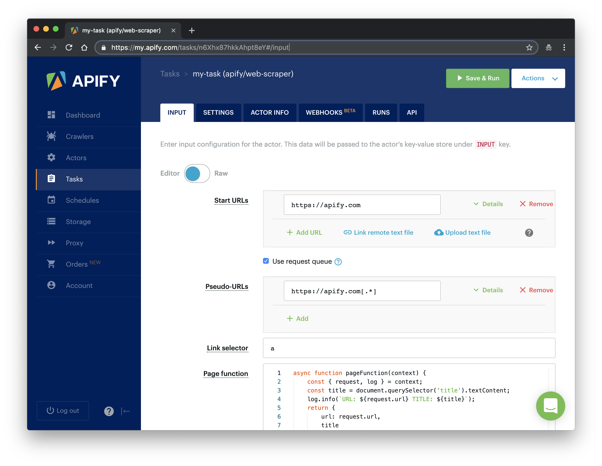
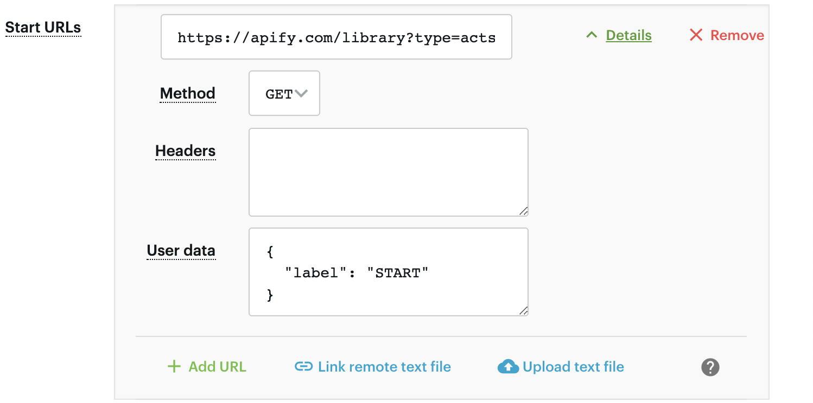
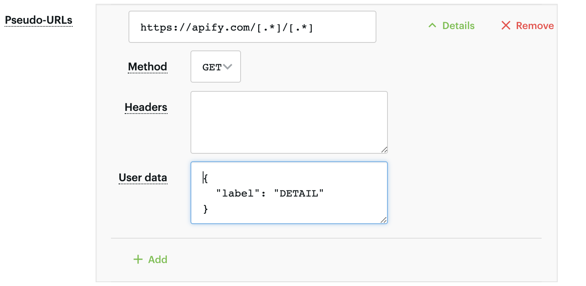
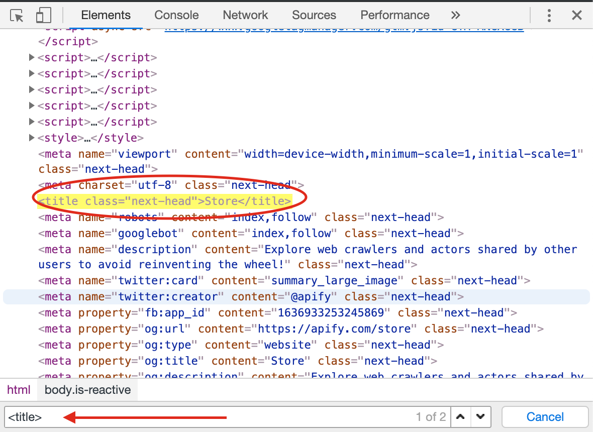

# Getting started with `apify/web-scraper`
Welcome to the getting started tutorial to walk you through creating your first scraping task step by step. You will learn how to set up all the different configuration options, code a `pageFunction` and finally download the scraped data as an Excel sheet, or in another format, such as JSON or CSV. But first, let's give you a brief introduction to Apify.

## What is `apify/web-scraper`
`apify/web-scraper` is an actor. If you want to know more about actors, you can read our [actors page](https://apify.com/actors) or [in the documentation](https://apify.com/docs/actor). For now, let's just think of an actor as an application that you can use with your own configuration. `apify/web-scraper` is therefore an application called `web-scraper`, built by `apify`, that you can configure to scrape any webpage. We call these configurations tasks.

You can create 10 different tasks for 10 different websites, with very different options, but there will always be just one actor, the `apify/web-scraper`. This is the essence of tasks. They are nothing but saved configurations of the actor that you can run easily and repeatedly.

## Creating your first task
Depending on how you arrived at this tutorial, you may already have your first task created for `apify/web-scraper`. If not, the easiest way is just to go to the [actor's library page](https://apify.com/apify/web-scraper) and click the **Try Actor** button. This will take you to the task configuration page.



## Task configuration
Before we jump into the scraping itself, let's just have a quick look at the user interface that's available to us.

### INPUT
The INPUT tab is where you create your scraping configuration and we'll talk about it in much more detail later. The creator of the actor prepares the INPUT form so that you can easily tell the actor what to do. 

### SETTINGS
In the settings tab, you can set various options that are common to all tasks and not directly related to the scraping itself. Unless you've already changed the task's name, it's `my-task`, so why not try changing it to `my-first-scraper` and clicking save. Below are the Build, Timeout and Memory options. Let's keep them at default settings for now. Just remember that if you see a big red `TIMED-OUT` after running your task, you might want to come back here and increase the timeout.

> Timeouts are there to prevent tasks from running forever. Always set a reasonable timeout to prevent a rogue task from eating up all your compute units.

### ACTOR INFO
Since tasks are just configurations for actors, this tab shows you all the information about the underlying actor, in our case `apify/web-scraper`. You can see the available versions and their READMEs and it's always a good idea to read an actor's README first before creating a task for it.

### WEBHOOKS
Webhooks are a feature that help keep you aware of what's happening with your tasks. You can set them up to inform you when a task starts, finishes, fails and so on, or you can even use them to run more tasks, depending on the outcome of the original one. You can find the [documentation on webhooks here](https://apify.com/docs/webhooks).

### RUNS
After you run your task for the first time, you will find the run here and will be able to open its detail page to see all information about it. All runs of your task including their results will be stored here for the data retention period, [which you can find under your plan](https://apify.com/pricing).

### API
The API tab gives you a quick overview of all the available API calls, if you would like to use your task programmatically, and includes links to detailed API documentation. You can even try it out immediately using the **TEST** button.

## The INPUT
Now let's go back to the INPUT tab. As you can see, there are already some values pre-configured in the INPUT. It says that the task should visit `https://apify.com` and all its subpages and scrape some data using the provided `pageFunction`, specifically the `<title>` of the page and its URL.

> We will not go through all the available INPUT options in this tutorial. See the actor's README under the ACTOR INFO tab for detailed information.

Before you click Run to see what happens, set the `Max pages per crawl` option to `10`. This tells your task to finish after 10 pages have been visited. We don't need to crawl the whole domain just to see that it works. It also helps with keeping your compute unit (CU) consumption low. Just to get an idea, the free plan includes 10 CUs and this run will consume about 0.04 CU, so you can run it 250 times a month for free. If you accidentally go over the limit, no worries, we won't charge you for it. You just won't be able to run more tasks that month.

Now click **Save & Run**! *(either at the very bottom or in the top-right corner of your screen)*

### The run detail
After clicking **Save & Run**, the window will change to the run detail. Here, you will see the Log of the run. If it seems that nothing is happening, don't worry, it takes a few seconds for the run to fully boot up. In under a minute, you should have the 10 pages scraped. You will know that the run successfully completed when the `RUNNING` card in top-left corner changes to `SUCCEEDED`.

> Feel free to browse through the various new tabs: LOG, INFO, INPUT and other, but for the sake of brevity, we will not explain all their features in this tutorial.

Now that the run has `SUCCEEDED`, click on the rightmost card labeled **Clean items** to see the results of the scrape. This takes you to the DATASET tab, where you can display or download the results in various formats. For now, just click the blue **Preview data** button. Voila, the scraped data. If you see a bunch of weird things like `#debug/errorMessages`, just check the **Clean data** checkbox above the top-left corner of the results table and it should go away.

Good job! We've run our first task and got some results. Let's learn how to change the default configuration to scrape something more interesting than just the page's `<title>`.

## Scraping theory
Since this is a tutorial, we'll be scraping our own website. A great candidate for some scraping practice is the [Apify Library](https://apify.com/library). It's a page that uses modern web technologies and displays a lot of different items in various categories, just like an online store, a typical scraping target, would.

### The goal
We want to create a scraper that scrapes all the actors (i.e. not crawlers, our legacy product) in the library and collects the following attributes for each actor:

   1. **URL** - The URL that goes directly to the actor's detail page.
   2. **Unique identifier** - Such as `apify/web-scraper`.
   4. **Title** - The title visible in the actor's detail page.
   5. **Description** - Tha actor's description.
   6. **Last run date**- When the actor was last run.
   7. **Number of runs** - How many times the actor was run.

Some of this information may be scraped directly from the listing pages, but for the rest, we will need to visit all detail pages of all the actors.

### The Start URL
Let's start with something simple. In the INPUT tab of the task we have, we'll change the Start URL from `https://apify.com`. This will tell the scraper to start by opening a different URL. You can add more Start URLs or even use a file with a list of thousands of them, but in this case, we'll be good with just one.

How do we choose the new Start URL? The goal is to scrape all actors in the library. If we go to the [library page](https://apify.com/library) and choose `Actors only` in the **Show** dropdown, we'll see that the URL in our address bar has changed to:

```
https://apify.com/library?type=acts
```

^^^ This is our new Start URL ^^^

We'll also need to somehow distinguish the Start URL from all the other URLs that the scraper will add later. To do this, click the green **Details** icon in the Start URL form and see the **User data** input. Here you can add any information you'll need during the scrape in a JSON format. For now, just add a label to the Start URL.

```json
{
  "label": "START"
}
```



### Crawling the website with Pseudo URLs
Before we can start scraping the actor details, we need to find all the links to the details. If the links follow a set structure, we can use Pseudo URLs to do just that. By setting a Pseudo URL, all links that follow the given structure will automatically be added to the crawling queue.

To find the structure, open some of the actor details in the library. You'll find that the URLs always follow the same pattern:

```
https://apify.com/{OWNER}/{NAME}
```
Where only the `OWNER` and `NAME` changes. We can leverage this in a Pseudo URL.

#### Making a Pseudo URL
If you'd like to learn more about Pseudo URLs, [visit a quick tutorial in our docs](https://sdk.apify.com/docs/guides/gettingstarted#introduction-to-pseudo-urls), but for now, let's keep it simple. Pseudo URLs are really just URLs with some variable parts in them. Those variable parts are represented by [regular expressions](https://www.regexbuddy.com/regex.html) enclosed in brackets `[]`.

So, working with our actor details example, we could produce a Pseudo URL like this:

```
https://apify.com/[.+]/[.+]
```

This Pseudo URL will match all actor detail pages, such as:

```
https://apify.com/apify/web-scraper
```

But it will not match pages we're not interested in, such as:

```
https://apify.com/contact
```
Let's use the above Pseudo URL in our task. We should also add a label as we did with our Start URL. This label will be added to all pages that were enqueued into the request queue using the given Pseudo URL.

```json
{
  "label": "DETAIL"
}
```



#### Test run
We've added some configuration, so it's time to test it. Just run the task, keeping the **Max pages per crawl** set to `10` and **Page function** the same. You should see in the log that the scraper first visits the Start URL and then several of the actor details, matching the Pseudo URL.

### The `pageFunction`
The Page function is a JavaScript function that gets executed for each page the scraper visits. To figure out how to create the `pageFunction`, you must first inspect the page's structure to get an idea of its inner workings. The best tools for that are Developer Tools in browsers, DevTools.

#### Using DevTools
Open the [library page](https://apify.com/library) in the Chrome browser (or use any other browser, just note that the DevTools may differ slightly) and open the DevTools, either by right-clicking on the page and selecting `Inspect` or by pressing `F12`.

The DevTools window will pop up, and display a lot of, perhaps unfamiliar, information. Don't worry about that too much and just open the Elements tab (the one with the page's HTML). The Elements tab allows you to browse the structure of the page and search within it using the search tool. You can open the search tool by pressing `CTRL+F` or `CMD+F`. Try typing `<title>` into the search bar.

You'll see that the Element tab jumps to the first `<title>` element of the current page and that the title is `Library`. It's always good practice to do your research using the DevTools before writing the `pageFunction` and running your task.



> For the sake of brevity, we won't go into the details of using the DevTools in this tutorial. If you're just starting out with DevTools, this [Google tutorial](https://developers.google.com/web/tools/chrome-devtools/) is a good place to begin.

#### Understanding `context`
The `pageFunction` has access to global variables, such as `window` or `document`, which are provided by the browser, but also to `context`, which is the single argument of the `pageFunction`. `context` carries a lot of useful information and helpful functions. A full reference can be found in the actor's README in the ACTOR INFO tab.

#### New `pageFunction` boilerplate
We know that we'll visit two kinds of pages, the list page (Start URL) and the detail pages (enqueued using the Pseudo URL). We want to enqueue links on the list page and scrape data on the detail page.

```js
async function pageFunction(context) {
    const { request, log, skipLinks } = context;
    if (request.userData.label === 'START') {
        log.info('Library opened!');
        // Do some stuff later.
    }
    if (request.userData.label === 'DETAIL') {
        log.info(`Scraping ${request.url}`);
        await skipLinks();
        // Do some scraping.
        return {
            // Scraped data.
        }
    }
}
```

This may seem like a lot of new things, but it's all connected to our earlier configuration.

#### `context.request`
The `request` is an instance of the [`Request`](https://sdk.apify.com/docs/api/request) class and holds information about the currently processed page, such as its `url`. Each `request` also has the `request.userData` property of type `Object`. While configuring the Start URL and the Pseudo URL, we set a `label` to it. We're now using it in the `pageFunction` to distinguish between the library page and the detail pages.

#### `context.skipLinks()`
When a Pseudo URL is set, the scraper attempts to enqueue matching links on all pages it visits. `skipLinks()` is used to tell the scraper that we don't want this to happen on the current page.

#### `context.log`
`log` is used for printing messages to the console. You may be tempted to use `console.log()`, but this will not work, unless you turn on the **Browser log** option. `log.info()` should be used for general messages, but you can also use `log.debug()` for messages that will only be shown when you turn on the **Debug log** option. [See the docs for more info](https://sdk.apify.com/docs/api/log).

#### Return value of the `pageFunction`
The `pageFunction` may only return nothing, `null`, `Object` or `Object[]`. If an `Object` is returned, it will be saved as a single result. Returning an `Array` of `Objects` will save each item in the array as a result.

The scraping results are saved in Dataset (one of the tabs in the run console, as you may remember). It behaves like a table. Each item is a row in the table and its properties are its columns. Returning the following `Object`:

```js
{
    url: 'https://apify.com',
    title: 'Web Scraping, Data Extraction and Automation - Apify'
}
```

Will produce the following table:

| title | url |
| ----- | --- |
| Web Scraping, Data Extraction and Automation - Apify | https://apify.com |

## Scraping practice - getting the data
We've covered all the concepts that we need to understand to successfully scrape the data in our goal, so let's get to it. Just a quick recap of the data we want:

   1. **URL** - The URL that goes directly to the actor's detail page.
   2. **Unique identifier** - Such as `apify/web-scraper`.
   4. **Title** - The title visible in the actor's detail page.
   5. **Description** - Tha actor's description.
   6. **Last run date**- When the actor was last run.
   7. **Number of runs** - How many times the actor was run.

### Scraping the URL and Unique identifier
For this information, we just need the `request.url` because it includes the Unique identifier.

```js
const { url } = request; 
const uniqueIdentifier = url.split('/').slice(-2).join('/');
```

### Test run 2
We'll add our first data to the `pageFunction` and carry out a test run to see that everything works as expected.

```js
async function pageFunction(context) {
    const { request, log, skipLinks } = context;
    if (request.userData.label === 'START') {
        log.info('Library opened!');
        // Do some stuff later.
    }
    if (request.userData.label === 'DETAIL') {
        log.info(`Scraping ${request.url}`);
        await skipLinks();
        // Do some scraping.
        const { url } = request; 
        const uniqueIdentifier = url.split('/').slice(-2).join('/');

        return {
            url,
            uniqueIdentifier,
        }
    }
}
```

Now **Save & Run** the task and once it finishes, check the results by going to the Dataset, either by clicking the **Clean items** card, or by going to the **DATASET** tab. Click **Preview data** again (and check Clean data, if unchecked). You should see the URLs and Unique identifiers scraped. Great job!

### Scraping Title, Description, Last run date and Number of runs
We've confirmed that the scraper works as expected, so now it's time to add more data to the results. To do that, we'll be using the infamous [`jQuery` library](https://jquery.com/), because it provides some nice tools and a lot of people familiar with JavaScript already know how to use it.

> If you're not familiar with `jQuery`, you can find good information [in the docs](https://api.jquery.com/) and if you just don't want to use it, that's okay. Everything can be done using pure JavaScript too.

To add `jQuery`, all we need to do is turn on **Inject jQuery** under INPUT **Options**. This will add a `context.jQuery` function that you can use.

Now that's out of the way, let's open one of the actor detail pages in the Library, for example the [`apify/web-scraper`](https://apify.com/apify/web-scraper) page and use our DevTools-Fu to figure out how to get the title of the actor.

#### Title


By using the element selector tool, we find out that the title is there under an `<h1>` tag, as titles should be. Maybe surprisingly, we find that there are actually two `<h1>` tags on the detail page. This should get us thinking. Is there any parent element that perhaps wraps all the information that we want to scrape? Yes, there is! The `<div class="wrap ...">` is a common ancestor to everything. So let's start by getting that element first.

> Remember that you can press CTRL+F (CMD+F) in the Elements tab of DevTools to open the search bar where you can quickly search for elements using their selectors.

Using the search bar to find `div.wrap` in the DevTools reveals that it's not the only `div.wrap` in the page, so we need to make the selector a little bit more specific by adding its parent element: `header div.wrap`.


```js
// Using jQuery.
const $wrapper = $('header div.wrap');
```
> Always make sure to use the DevTools to verify your scraping process and assumptions. It's faster than changing the crawler code all the time.

Getting the title should now be pretty easy. We know that it's in the `$wrapper` so we just need to find it there using `jQuery`:

```js
const $wrapper = $('header div.wrap');
return {
    title: $wrapper.find('h1').text(),
};
```

#### Description
Getting the actor's description is a piece of cake. We already have the boilerplate ready, so all we need to do is add a new selection.


```js
const $wrapper = $('header div.wrap');
return {
    title: $wrapper.find('h1').text(),
    description: $wrapper.find('p').text(),
};
```

Getting the `lastRunDate` and `runCount` is not as straightforward as the previous items, but not to worry, it's still pretty simple.

#### Last run date
The DevTools tell us that the `lastRunDate` can be found in the second of the two `<time>` elements in the `$wrapper`.


```js
const $wrapper = $('header div.wrap');
return {
    title: $wrapper.find('h1').text(),
    description: $wrapper.find('p').text(),
    lastRunDate: new Date(Number($wrapper.find('time').eq(1).attr('datetime'))),
};
```

It might look a little too complex at first glance, but let me walk you through it. We take our `$wrapper` and find the `<time>` elements it contains. There are two, so we grab the second one using the `.eq(1)` call (it's zero indexed) and then we read its `datetime` attribute, because that's where a unix timestamp is stored as a `string`.

But we would much rather see a readable date in our results, not a unix timestamp, so we need to convert it. Unfortunately the `new Date()` constructor will not accept a `string`, so we cast the `string` to a `number` using the `Number()` function before actually calling `new Date()`. Phew!

#### Run count
And so we're finishing up with the `runCount`. There's no specific element like `<time>`, so we need to create a complex selector and then do a transformation on the result.

```js
const $wrapper = $('header div.wrap');
return {
    title: $wrapper.find('h1').text(),
    description: $wrapper.find('p').text(),
    lastRunDate: new Date(Number($wrapper.find('time').eq(1).attr('datetime'))),
    runCount: Number($wrapper.find('div.stats > span:nth-of-type(3)').text().match(/\d+/)[0]),
};
```

The `div.stats > span:nth-of-type(3)` looks complicated, but it only reads that we're looking for a `<div class="stats ...">` element and within that element we're looking for the third `<span>` element. We grab its text, but we're only interested in the number of runs. So we parse the number out using a regular expression, but its type is still a `string`, so we finally convert the result to a `number` by wrapping it with a `Number()` call.

#### Wrapping it up
And there we have it! All the data we needed in a single object. For the sake of completeness, let's add the properties we parsed from the URL earlier and we're good to go.

```js
const { url } = request; 
const uniqueIdentifier = url.split('/').slice(-2).join('/');
const $wrapper = $('header div.wrap');

return {
    url,
    uniqueIdentifier,
    title: $wrapper.find('h1').text(),
    description: $wrapper.find('p').text(),
    lastRunDate: new Date(Number($wrapper.find('time').eq(1).attr('datetime'))),
    runCount: Number($wrapper.find('div.stats > span:nth-of-type(3)').text().match(/\d+/)[0]),
};
```

All we need to do now is to add this to our `pageFunction`:

```js
async function pageFunction(context) {
    const { request, log, skipLinks, jQuery: $ } = context; // Use jQuery as $
    if (request.userData.label === 'START') {
        log.info('Library opened!');
        // Do some stuff later.
    }
    if (request.userData.label === 'DETAIL') {
        log.info(`Scraping ${request.url}`);
        await skipLinks();
        // Do some scraping.
        const { url } = request; 
        const uniqueIdentifier = url.split('/').slice(-2).join('/');
        const $wrapper = $('header div.wrap');

        return {
            url,
            uniqueIdentifier,
            title: $wrapper.find('h1').text(),
            description: $wrapper.find('p').text(),
            lastRunDate: new Date(Number($wrapper.find('time').eq(1).attr('datetime'))),
            runCount: Number($wrapper.find('div.stats > span:nth-of-type(3)').text().match(/\d+/)[0]),
        };
    }
}
```

#### Test run 3
As always, try hitting that **Save & Run** button (don't forget to tick that **Inject jQuery** box) and visit the Dataset preview of clean items. You should see a nice table of all the attributes correctly scraped. You nailed it!

## Pagination
Pagination is just a term that represents "going to the next page of results". You may have noticed that we did not actually scrape all the actors, just the first page of results. That's because to load the rest of the actors, one needs to click the orange **Show more** button at the very bottom of the list. This is pagination.

> This is a typical JavaScript pagination, sometimes called infinite scroll. Other pages may just use links that take you to the next page. If you encounter those, just make a Pseudo URL for those links and they will be automatically enqueued to the request queue. Use a label to let the scraper know what kind of URL it's processing.

### Waiting for dynamic content
Before we talk about paginating, we need to have a quick look at dynamic content. Since the Apify Library is a JavaScript application (as many, if not most modern websites are), the button might not exist in the page when the scraper runs the `pageFunction`.

How is this possible? Because the scraper only waits with executing the `pageFunction` for the page to load its HTML. If there's additional JavaScript that modifies the DOM afterwards, the `pageFunction` may execute before this JavaScript had the time to run.

At first, you may think that the scraper is broken, but it just cannot wait for all the JavaScript in the page to finish executing. For a lot of pages, there's always some JavaScript executing or some network requests being made. It would never stop waiting. It is therefore up to you, the programmer, to wait for the elements you need. Fortunately, we have an easy solution.

#### The `context.waitFor()` function
`waitFor()` is a function that's available on the `context` object passed to the `pageFunction` and helps you with, well, waiting for stuff. It accepts either a number of milliseconds to wait, a selector to await in the page, or a function to execute. It will stop waiting once the time elapses, the selector appears or the provided function returns `true`.

```js
await waitFor(2000); // Waits for 2 seconds.
await waitFor('#my-id'); // Waits until an element with id "my-id" appears in the page.
await waitFor(() => !!window.myObject); // Waits until a "myObject" variable appears on the window object.
```

The selector may never be found and the function might never return `true`, so the `waitFor()` function also has a timeout. The default is `20` seconds. You can override it by providing an options object as the second parameter, with a `timeoutMillis` property.

```js
waitFor('.bad-class', { timeoutMillis: 5000 });
```

With those tools, you should be able to handle any dynamic content the website throws at you.

### How to paginate
With the theory out of the way, this should be pretty easy. The algorithm is a loop: 

   1. Wait for the **Show more** button.
   2. Click it.
   3. Is there another **Show more** button?
      - Yes? Repeat the above. (loop)
      - No? We're done. We have all the actors.

#### Waiting for the button
Before we can wait for the button, we need to know its unique selector. A quick look in the DevTools tells us that the button's class is some weird randomly generated string, but fortunately, there's an enclosing `<div>` with a class of `show-more`. Great! Our unique selector:

```
div.show-more > button
```

> Don't forget to confirm our assumption in the DevTools finder tool (CTRL/CMD + F).


Now that we know what to wait for, we just plug it into the `waitFor()` function.

```js
await waitFor('div.show-more > button');
```

#### Clicking the button
We have a unique selector for the button and we know that it's already rendered in the page. Clicking it is a piece of cake. We'll use `jQuery` again, but feel free to use plain JavaScript, it works the same.

```js
$('div.show-more > button').click()
```

This will show the next page of actors.

#### Repeating the process
We've shown two function calls, but how do we make this work together in the `pageFunction`?

```js
async function pageFunction(context) {

// ...

let timeout; // undefined
const buttonSelector = 'div.show-more > button';
while (true) {
    log.info('Waiting for the "Show more" button.');
    try {
        await waitFor(buttonSelector, { timeout }); // Default timeout first time.
        timeout = 2000; // 2 sec timeout after the first.
    } catch (err) {
        // Ignore the timeout error.
        log.info('Could not find the "Show more button", we\'ve reached the end.');
        break;
    }
    log.info('Clicking the "Show more" button.');
    $(buttonSelector).click();   
}

// ...

}
```

We want to run this until the `waitFor()` function throws, so that's why we use a `while(true)` loop. We're also not interested in the error, because we're expecting it, so we just ignore it and print a log message instead.

You might be wondering what's up with the `timeout`. Well, for the first page load, we want to wait longer, so that all the page's JavaScript has had a chance to execute, but for the other iterations, the JavaScript is already loaded and we're just waiting for the page to re-render so waiting for `2` seconds is enough to confirm that the button is not there. We don't want to stall the scraper for `20` seconds just to make sure that there's no button.

### Plugging it into the `pageFunction`
We've got the general algorithm ready, so all that's left is to integrate it into our earlier `pageFunction`. Remember the `// Do some stuff later` comment? Let's replace it. And don't forget to destructure the `waitFor()` function on the first line.

```js
async function pageFunction(context) {
    const { request, log, skipLinks, jQuery: $, waitFor } = context;
    if (request.userData.label === 'START') {
        log.info('Library opened!');
        let timeoutMillis; // undefined
        const buttonSelector = 'div.show-more > button';
        while (true) {
            log.info('Waiting for the "Show more" button.');
            try {
                await waitFor(buttonSelector, { timeoutMillis }); // Default timeout first time.
                timeoutMillis = 2000; // 2 sec timeout after the first.
            } catch (err) {
                // Ignore the timeout error.
                log.info('Could not find the "Show more button", we\'ve reached the end.');
                break;
            }
            log.info('Clicking the "Show more" button.');
            $(buttonSelector).click();   
        }

    }
    if (request.userData.label === 'DETAIL') {
        log.info(`Scraping ${request.url}`);
        await skipLinks();
        // Do some scraping.
        const { url } = request; 
        const uniqueIdentifier = url.split('/').slice(-2).join('/');
        const $wrapper = $('header div.wrap');

        return {
            url,
            uniqueIdentifier,
            title: $wrapper.find('h1').text(),
            description: $wrapper.find('p').text(),
            lastRunDate: new Date(Number($wrapper.find('time').eq(1).attr('datetime'))),
            runCount: Number($wrapper.find('div.stats > span:nth-of-type(3)').text().match(/\d+/)[0]),
        };
    }
}
```

That's it! You can now remove the **Max pages per crawl** limit, **Save & Run** your task and watch the scraper paginate through all the actors and then scrape all of their data. After it succeeds, open the Dataset again and see the clean items. You should have a table of all the actor's details in front of you. If you do, great job! You've successfully scraped the Apify Library. And if not, no worries, just go through the code examples again, it's probably just some typo.


### Downloading the scraped data
You already know the DATASET tab of the run console since this is where we've always previewed our data. Notice that at the bottom, there is a table with multiple data formats, such as JSON, CSV or an Excel sheet, and to the right, there are options to download the scraping results in any of those formats. Go ahead and try it.

> If you prefer working with an API, you can find an example in the API tab of the run console: **Get dataset items**.

#### Items and Clean items
There are two types of data available for download. Items and Clean items. The Items will always include a record for each `pageFunction` invocation, even if you did not return any results. The record also includes hidden fields such as `#debug`, where you can find various information that can help you with debugging your scrapers.

Clean items, on the other hand, include only the data you returned from the `pageFunction`. If you're only interested in the data you scraped, this format is what you will be using most of the time.

### Bonus: Making your `pageFunction` neater
You may have noticed that the `pageFunction` gets quite bulky. To make better sense of your code and have an easier time maintaining or extending your task, feel free to define other functions inside the `pageFunction` that encapsulate all the different logic. You can, for example, define a function for each of the different pages:

```js
async function pageFunction(context) {
    const { label } = context.request.userData;
    if (label === 'START') return handleStart(context);
    if (label === 'DETAIL') return handleDetail(context);

    async function handleStart({ log, waitFor }) {
        log.info('Library opened!');
        let timeoutMillis; // undefined
        const buttonSelector = 'div.show-more > button';
        while (true) {
            log.info('Waiting for the "Show more" button.');
            try {
                await waitFor(buttonSelector, { timeoutMillis }); // Default timeout first time.
                timeoutMillis = 2000; // 2 sec timeout after the first.
            } catch (err) {
                // Ignore the timeout error.
                log.info('Could not find the "Show more button", we\'ve reached the end.');
                break;
            }
            log.info('Clicking the "Show more" button.');
            $(buttonSelector).click();   
        }
    }

    async function handleDetail({ request, log, skipLinks }) {
        log.info(`Scraping ${request.url}`);
        await skipLinks();
        // Do some scraping.
        const { url } = request; 
        const uniqueIdentifier = url.split('/').slice(-2).join('/');
        const $wrapper = $('header div.wrap');

        return {
            url,
            uniqueIdentifier,
            title: $wrapper.find('h1').text(),
            description: $wrapper.find('p').text(),
            lastRunDate: new Date(Number($wrapper.find('time').eq(1).attr('datetime'))),
            runCount: Number($wrapper.find('div.stats > span:nth-of-type(3)').text().match(/\d+/)[0]),
        };
    }
}
```

> If you're confused by the functions being declared below their executions, it's called hoisting and it's a feature of JavaScript. It helps you put what matters on top, if you so desire.

We plan to release an update to the `apify/web-scraper` in the future, where you would also be able to declare a `setupFunction`. You would then be able to declare your functions in the `setupFunction` and also do other pre-processing, such as download some resources from an API, without having to integrate this into the `pageFunction` so stay tuned!

## Final word
Thank you for reading this whole tutorial! Really! It's important to us that our users have the best information available to them so that they can use Apify easily and effectively. We're glad that you made it all the way here and congratulations on creating your first scraping task. We hope that you liked the tutorial and if there's anything you'd like to tell us, [let us know in our forum](https://forum.apify.com)!

Finally, `apify/web-scraper` is just an actor and writing your own actors is a breeze with the [Apify SDK](https://sdk.apify.com). It's a bit more complex and involved than writing a simple `pageFunction`, but it allows you to fine-tune all the details of your scraper to your liking. Perhaps some other time, when you're in the mood for yet another tutorial, visit the [Getting Started](https://https://sdk.apify.com/docs/guides/gettingstarted). We think you'd like it!
